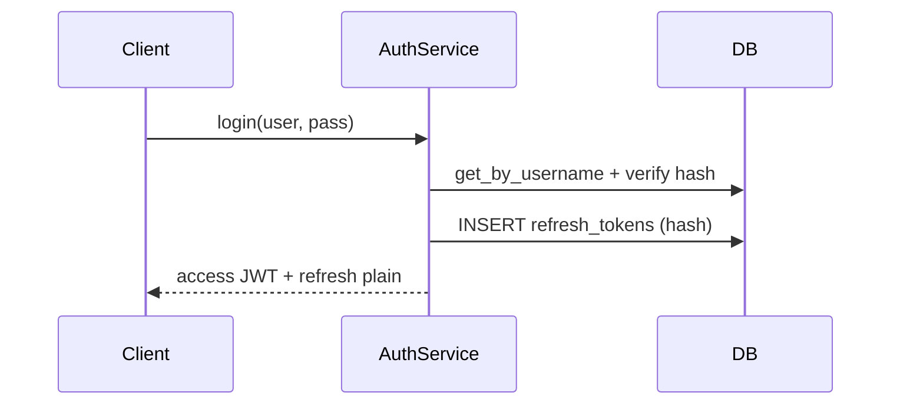

# AuthService — опис сервісу

Файл: `src/services/auth.py`  
Призначення: реєстрація, логін, JWT access/refresh, logout, **Depends для RBAC** (тема 09 + 10).

Окремо в цьому модулі — функції хешування, створення/розбору JWT і `get_current_*` (не всередині класу `AuthService`).

## Шари

```text
routes/auth.py, routes/todos.py, routes/access.py
        ↓ Depends
get_auth_service / get_current_user / get_current_moderator_user / get_current_admin_user
        ↓
AuthService → UserRepository, RefreshTokenRepository
```

Роути **не** ходять у репозиторії напряму.

## JWT access token

### `create_access_token(user: CurrentUser) -> str`

Payload:

| Claim | Зміст |
|-------|--------|
| `sub` | username |
| `user_id` | id |
| `role` | `user.role.value` (`user` / `moderator` / `admin`) |
| `type` | `"access"` |
| `exp` | TTL з `ACCESS_TOKEN_EXPIRE_MINUTES` |

Підпис: `JWT_SECRET_KEY`, `JWT_ALGORITHM` з `.env`.

**Роль у токені** — RBAC на кожен запит **без** SELECT user з БД (`get_current_user` лише декодує JWT).

### `decode_access_token(token) -> CurrentUser`

Перевіряє підпис і claims → `CurrentUser`. Помилка → `401`.

## Depends (RBAC)

| Функція | Умова | HTTP |
|---------|--------|------|
| `get_current_user` | валідний Bearer access | 401 |
| `get_current_moderator_user` | role ∈ `moderator`, `admin` | 403 |
| `get_current_admin_user` | role == `admin` | 403 |

Ланцюжок: moderator/admin залежать від `get_current_user` (роль з JWT).

## AuthService

Створюється на request: `get_auth_service(db)`.

### `register(body: UserCreate)`

- перевірка username/email (409 якщо зайняті)
- `create_user` + Argon2 hash пароля
- повертає ORM `User` → роут серіалізує в `UserResponse`

### `login(username, password) -> TokenPair`

- user з БД, `verify_password`
- `create_token_pair`: access JWT + opaque refresh у таблиці `refresh_tokens` (зберігається **hash**, не сам рядок)

### `create_token_pair(user) -> TokenPair`

Використовується з `login`. Refresh: `secrets.token_urlsafe(64)`, TTL `REFRESH_TOKEN_EXPIRE_DAYS`.

### `refresh_access_token(refresh_token) -> str`

- hash refresh → пошук у БД, перевірка `expires_at`
- user з БД → **новий access** з актуальною `role` з БД
- старий access до `exp` ще валідний (компроміс JWT)

### `logout(refresh_token, current_user)`

- потрібен **Bearer access** + refresh у body
- refresh має належати `current_user.id`, інакше 403
- `DELETE` refresh з БД; access до TTL ще може працювати

## Допоміжні функції

| Функція | Роль |
|---------|------|
| `hash_password` / `verify_password` | Argon2 (pwdlib) |
| `hash_token` | SHA-256 refresh для зберігання в БД |
| `utc_now` | naive UTC для порівняння з `expires_at` |

## Конфіг (.env)

| Змінна | Роль |
|--------|------|
| `JWT_SECRET_KEY` | підпис access |
| `JWT_ALGORITHM` | зазвичай `HS256` |
| `ACCESS_TOKEN_EXPIRE_MINUTES` | TTL access |
| `REFRESH_TOKEN_EXPIRE_DAYS` | TTL refresh у БД |

## Хто викликає

| Endpoint | Метод / Depends |
|----------|-----------------|
| `POST /api/auth/register` | `AuthService.register` |
| `POST /api/auth/login` | `AuthService.login` |
| `POST /api/auth/refresh` | `AuthService.refresh_access_token` |
| `POST /api/auth/logout` | `AuthService.logout` + `get_current_user` |
| `GET /api/auth/me` | `get_current_user` |
| `/api/todos/*` | `get_current_user` |
| `/api/access/*` | `get_current_*` за ендпоінтом |

## Схеми

- `src/schemas/auth.py` — `CurrentUser`, `TokenPair`, `AccessToken`, `RefreshTokenRequest`
- `src/schemas/user.py` — `UserCreate`, `UserResponse` (register)

## Нюанси для лаби

1. Після зміни `JWT_SECRET_KEY` — старий access → 401.
2. Після `PATCH .../role` — нова роль у access лише після `login` / `refresh`.
3. Logout без Bearer — не приймається (захист від відкликання чужого refresh).

## Потік логіну


