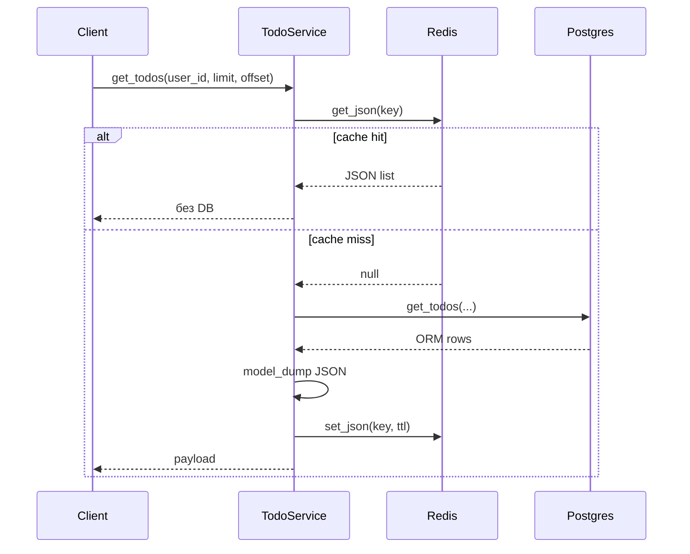

# CacheService — опис сервісу

Файл: `src/services/cache.py`  
Призначення: кешування **списку своїх todos** у Redis (тема 10).

Глобальний інстанс на весь процес:

```python
cache_service = CacheService(settings.REDIS_URL)
```

Підключення з `.env` → `REDIS_URL=redis://localhost:6379/0`. Клієнт `redis.asyncio`, `decode_responses=True` (рядки з Redis уже `str`, не `bytes`).

## Навіщо взагалі

Не кешується все підряд. Тільки **`GET /api/todos/`** (список todos поточного user) — найчастіший read, демонстрація «другий запит без DB hit».

Не кешується:

- `get_all_todos` (moderator/admin)
- один todo за id
- users / auth

## Методи

### `__init__(redis_url)`

Створює async-клієнт Redis. Живе, поки працює uvicorn.

### `ping() -> bool`

`PING` до Redis. Використання: `GET /readyz` — якщо `False` → **503** (додаток не готовий).

Помилка ловиться, логується, повертається `False` — процес не падає.

### `close()`

`aclose()` при shutdown. Викликається з `lifespan` у `main.py`.

### `todos_list_key(user_id, limit, offset) -> str`

Фабрика ключа:

```text
todos:list:42:10:0
         │   │  │ └ offset
         │   │  └── limit
         │   └───── user_id
         └────────── префікс
```

Різні `limit` / `offset` → різні ключі (окремий кеш на кожну пагінацію).

### `get_json(key) -> Any | None`

1. `GET key` з Redis
2. `None` → cache miss
3. інакше `json.loads` → list/dict у Python

Повертає готовий JSON (list dict-ів todos), не ORM.

### `set_json(key, value, ttl_seconds) -> None`

1. `json.dumps(value, default=str)` — дати/enum у рядок за потреби
2. `SET key ... ex=ttl` — TTL з `CACHE_TTL_SECONDS` (за замовч. 60 с)

Після TTL ключ зникає сам — застарілі дані максимум на час TTL, якщо не викликали invalidate.

### `invalidate_user_todos(user_id) -> None`

Скидає всі кеші списків цього user:

```text
SCAN todos:list:{user_id}:*
DELETE кожен ключ
```

Після create / update / delete треба прибрати всі варіанти `limit` / `offset`.

## Інтеграція з TodoService.get_todos

1. Зібрати `cache_key` через `todos_list_key`
2. `get_json` — **hit** → відповідь без Postgres (немає `DB hit: get_todos` у логах)
3. **miss** → `todo_repository.get_todos` → `TodoResponse.model_dump` → `set_json` → відповідь

При hit повертається `list[dict]`, не ORM — для FastAPI це той самий JSON, що й з `response_model=list[TodoResponse]`.

## Коли викликається invalidate

| Дія | invalidate |
|-----|------------|
| `create_todo` | так |
| `update_todo` / `update_status` | так, якщо todo знайдено |
| `remove_todo` | так, якщо видалено |
| `get_todo` (один) | ні |
| `get_all_todos` | ні |

## Конфіг (.env)

| Змінна | Роль |
|--------|------|
| `REDIS_URL` | URL підключення |
| `CACHE_TTL_SECONDS` | `ex=` при `set_json` |

## Обмеження (навмисні для лаби)

- Немає кешу для moderator-списку та single todo
- Немає tag-based invalidation — тільки `SCAN` по префіксу
- Немає graceful fallback «Redis впав — тихо в БД» на кожен GET; `readyz` перевіряє Redis при healthcheck

## Перевірка в лабі

1. `docker compose up -d` (postgres + redis)
2. Логін, два рази `GET /api/todos/` з тим самим `limit` / `offset`
3. У логах один `DB hit: get_todos user_id=...`, другий запит — без нього

## Потік запиту (схема)


