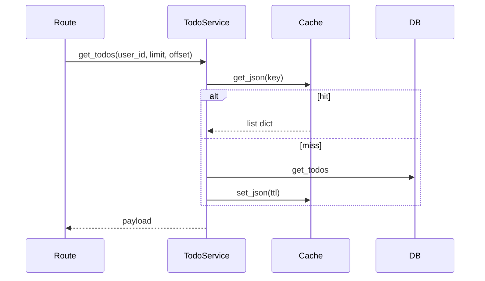

# TodoService — опис сервісу

Файл: `src/services/todos.py`  
Призначення: CRUD todos поточного user + список усіх todos для moderator; інтеграція з **CacheService** (тема 10).

## Шари

```text
routes/todos.py, routes/access.py (moderator)
        ↓ Depends(get_todo_service)
TodoService → TodoRepository
            ↘ cache_service (лише get_todos + invalidate)
```

Роути **не** викликають репозиторій напряму.

## Створення на request

```python
async def get_todo_service(db: Depends(get_db)) -> TodoService:
    return TodoService(db)
```

Один `TodoService` на HTTP-запит, своя сесія SQLAlchemy.

## Методи

### `create_todo(body, user_id)`

1. `todo_repository.create_todo`
2. `cache_service.invalidate_user_todos(user_id)` — скинути кеш списків
3. повертає ORM `Todo`

### `get_todos(user_id, limit, offset)` — з кешем

Єдиний метод з Redis. Детально: [`cache.md`](cache.md).

Коротко:

1. ключ `todos:list:{user_id}:{limit}:{offset}`
2. hit → JSON з Redis, без Postgres
3. miss → `get_todos` у репо → `model_dump` → `set_json` з `CACHE_TTL_SECONDS`

Повертає `list[dict]` при hit/miss після серіалізації — роут: `response_model=list[TodoResponse]`.

### `get_todo(todo_id, user_id)`

Один todo, **фільтр `user_id`** — чужий id → `None` → роут 404.

**Без кешу.**

### `get_all_todos(limit, offset)` — без кешу

Усі todos в системі, **без** `WHERE user_id`.

Використання: `GET /api/access/moderator/todos` (moderator або admin).

Повертає ORM `Sequence[Todo]` — серіалізація через `response_model` у роуті.

### `update_todo` / `update_status_todo`

Оновлення лише свого todo (`user_id` у репо). Якщо знайдено → `invalidate_user_todos`.

### `remove_todo`

Видалення свого todo. Якщо видалено → invalidate.

## get_todos vs get_all_todos

| | `get_todos` | `get_all_todos` |
|---|-------------|-----------------|
| Хто | user (свої) | moderator/admin |
| SQL | `WHERE user_id = ?` | без фільтра user |
| Кеш Redis | так | ні |
| Роут | `GET /api/todos/` | `GET /api/access/moderator/todos` |

Окремі методи — різний scope і політика кешу, не дубль «про всяк випадок».

## Invalidate кешу

Викликається після: create, update, update_status, remove (якщо операція успішна).

Не викликається: `get_todo`, `get_all_todos`.

## Конфіг

| Змінна | Де використовується |
|--------|---------------------|
| `CACHE_TTL_SECONDS` | TTL у `get_todos` |
| `REDIS_URL` | через `cache_service` |

## Перевірка кешу (лаба)

1. Логін `user_demo`
2. Двічі `GET /api/todos/?limit=10&offset=0`
3. У логах один `DB hit: get_todos user_id=...`

## Потік get_todos



## Схеми

`src/schemas/todo.py` — `TodoSchema`, `TodoResponse`, `TodoUpdateSchema`, …

## Пов’язані файли

- `src/repository/todos.py` — SQL
- `src/services/cache.py` — Redis
- `src/routes/todos.py` — user API
- `src/routes/access.py` — moderator список
