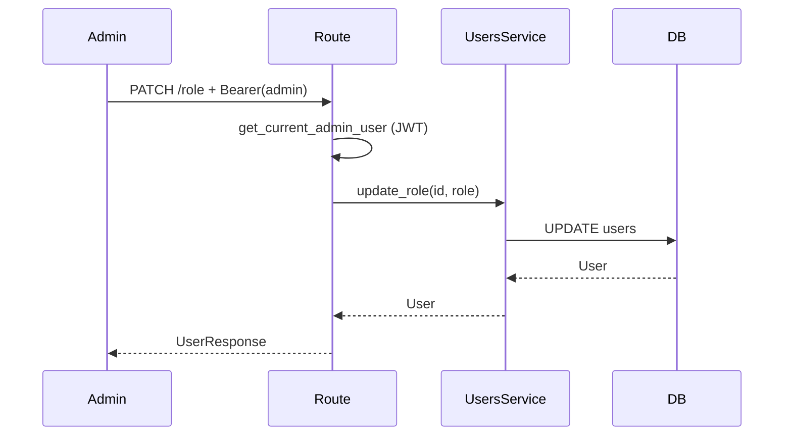

# UsersService — опис сервісу

Файл: `src/services/users.py`  
Призначення: операції адміна над користувачами (список, зміна ролі). Тема 10 — RBAC.

## Шари

```text
routes/access.py (admin endpoints)
        ↓ Depends(get_users_service)
UsersService → UserRepository
```

Роути **не** викликають `UserRepository` напряму.  
Перевірка «ти admin» — у роуті через `Depends(get_current_admin_user)` (роль з JWT), не в `UsersService`.

## Створення на request

```python
async def get_users_service(db: Depends(get_db)) -> UsersService:
    return UsersService(db)
```

## Методи

### `list_users() -> list[User]`

Усі users з БД (`ORDER BY id`). Повертає ORM-моделі.

Роут: `GET /api/access/admin/users`, `response_model=list[UserResponse]` — FastAPI мапить ORM → JSON.

### `update_role(user_id, role) -> User | None`

Оновлює `users.role` у Postgres. `None` — user не знайдено.

Роут `PATCH /api/access/admin/users/{user_id}/role`:

- викликає `update_role`
- якщо `None` → `HTTP 404` у **роуті** (не в сервісі)

## Чому не AdminService

Сервіс названий за **сутністю** (users), не за роллю в URL.  
`get_current_admin_user` — це auth/RBAC; `UsersService` — дані users.

## Хто викликає

| Endpoint | Сервіс | Depends auth |
|----------|--------|----------------|
| `GET /api/access/admin/users` | `list_users` | `get_current_admin_user` |
| `PATCH /api/access/admin/users/{id}/role` | `update_role` | `get_current_admin_user` |

`user_demo` → 403 на admin endpoints.  
`admin_demo` → 200.

## Схеми

- `src/schemas/user.py` — `UserResponse`, `UserRoleUpdate`
- `src/entity/models.py` — `User`, `UserRole` enum

## RBAC і JWT

Після `update_role` у БД **access token не оновлюється** — у JWT лишається стара `role` до `exp` або до `refresh`/`login`.

Для лаби: після зміни ролі — перелогін або `POST /api/auth/refresh`.

## Обмеження (лаба)

- Немає пагінації списку users
- Немає видалення user
- Немає audit (хто змінив роль)

## Потік зміни ролі



## Пов’язані файли

- `src/repository/users.py`
- `src/routes/access.py`
- `src/services/auth.py` — `get_current_admin_user`
